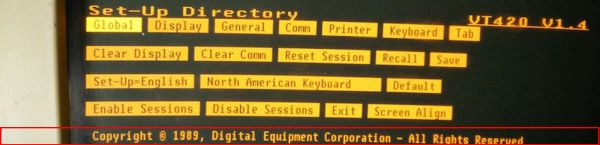
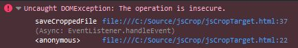
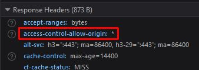
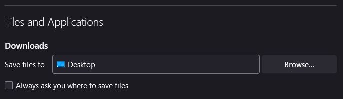
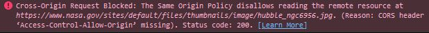
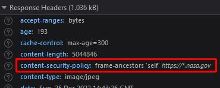

Notes about browser bookmarklets and a CORS "Security Theater" mini-rant

<!--more-->

Bookmarklets are a handy browser feature that doesn't seem to be widely known. They are bookmarks in your browser toolbar that contain a block of JavaScript rather than a link to a page or website. The execution context of the JS is whatever page you are currently viewing. Every five or six years, I run into a situation where a bookmarklet would be handy, and I have to go look up the syntax and re-learn all the same little gotchas, so this article was intended as a "note to self".

Why does the subhead of an article about bookmarklets also mention Cross-Origin Resource Sharing, or CORS? Unfortunately, it _is_ relevant to some bookmarklet use-cases, to my surprise and dismay, and I've always wanted to rant about the sheer stupidity of CORS. It has never warranted a full article, and today's rant is brief, but this article bumped into enough CORS-noise that it finally bears mentioning.

I exclusively use Mozilla Firefox these days (performance is dramatically superior to any Chromium-based browser), and while bookmarklets are supported in all major browsers, certain features and limitations may vary -- hopefully "web browser inconsistency" isn't a big surprise to you! Lately my employer has chosen to force everyone to use Microsoft Edge (and Google Chrome is being phased out; Firefox was never permitted), so if I encounter any major inconsistencies between Firefox and Edge or Chrome, I'll update the article with notes or new sections as needed. To my knowledge, only a single item (an old bug) in this first version of the article is Firefox-specific.

## Bookmarklet Basics

As mentioned above, bookmarklets are just browser bookmarks that contain a JS function instead of a target file or browser location. (A long time ago, Windows introduced a feature called "scriptlets", and more recently the term has been applied to other short chunks of script code supported by various systems and technologies. It seems likely the term "bookmarklet" was a spinoff of the term "scriptlet" as they were introduced in the same general timeframe. Another term that never caught on was "favelet".)

Also as mentioned above, the execution context of a bookmarklet is any page you're currently viewing. It's literally as if there were a button built into the page which executes your bookmarklet script function when you click on it (with a few caveats around the meaning of the JS `this` keyword; I find it's easiest to just avoid `this` in bookmarklets). Note that if the bookmarklet script fails for some reason, it will do so silently. You can usually see an error message in the <kbd>F12</kbd> Developer Tools console output.

Although the content is a single JS function, a very common usage pattern is to inject a `<script>` tag that points to a JS file on a server somewhere, which allows you to execute code of arbitrary complexity. We don't do that in this article, but you should be aware of that option.

In every browser, you create a bookmarklet the same way you manually create any other bookmark. In Firefox, for example, you can right-click your bookmark toolbar, choose `Add bookmark...`, and in the dialog box enter a name, then add your script in the URL field. Even though bookmarklets were contemplated as early as 1995 (though not by that name) and have been supported in one form or another for more than 20 years, the facts that you still must create them in a single-line text field and there is no worthwhile means of debugging them demonstrates that modern browsers offer only rudimentary support for this feature. Yet, I think you will find that when you discover a use-case, they are well worth the minor hassles of creating and testing them.

In fact, the basic syntax of a bookmarklet was conceived as a type of URL way back in 1995 via the `javascript:` pseudo-protocol (in the sense that `http:` or `ftp:` URL prefixes are protocols in the traditional sense of the word). Because they are literally a kind of URL, there are a few gotchas we'll discuss later, which are some of the reasons I wrote this "note to self" article in the first place. The modern syntax is a lambda or anonymous function, or what the script-kiddies refer to as ["arrow notation"](https://developer.mozilla.org/en-US/docs/Web/JavaScript/Reference/Functions/Arrow_functions), combined with the infamously-confusing JavaScript [IIFE](https://developer.mozilla.org/en-US/docs/Glossary/IIFE) pile o' parenthesis, with your handy-dandy bookmarklet code inside those braces (er, "curly brackets" to you gramatically-challenged 21st century script-kiddies):

```js
javascript: (()=>{ ... })()
```

Once you create a bookmarklet, the browser stores it as a single line of text (like all URLs). Even if you cut-and-paste a multi-line function into the browser, all modern browsers discard the line breaks (forever, unfortunately, even if you cut-and-paste it _from_ the bookmark's URL field later on). This implies a few things about developing your bookmarklet:

* plan to use an external editor to write and modify your code
* if it's important to you, keep a separate copy in a `.js` file somewhere
* consider starting with a simple `.html` file for your intial testing

## Bookmarklet Examples

I ran into my first use-case for a bookmarklet around 15 years ago. Someone had developed a very complicated form through which we were required to submit weekly timesheets. We really only needed to manually enter information into just one of the twenty-plus fields on the form, so my search for a way to automate the other fields led me to discover bookmarklets. With the click of a bookmark toolbar button, I was able to populate all of the repetitive data and set the focus to the one place I had to actually type something new each week.

A few years later, I was required to interact with a mainframe system that output pages of data as minimally-formatted HTML (yes, it was as terrible as it sounds). There was no UI at all. The page it displayed was controlled by a number embedded in the URL. To view other pages, you had to manually edit the URL. Eventually I wrapped this in an `<iframe>` with button controls (this was long before there were restrictions on controlling content loaded from other sources), but for many months I relied on a pair of simple page forward/backward bookmarklets that incremented or decremented the page number via reading and setting `document.location`.

I no longer have the details of either of those, but consider the following block of JS which addresses a similar hypothetical situation, a URL that ends in a `&page=123` querystring argument. This code attempts to find a number at the end of the URL, increments that number by one, and navigates to the new URL:

```js
javascript:(()=>{
	var url=document.location.toString().split("=");
	var last=url.length - 1;
	url[last]=(parseInt(url[last],10) + 1).toString();
	if(url[last]!=="NaN") document.location=url.join("="); 
})();
```

There are many ways to accomplish the same thing (for example, I could have used the [UrlSearchParams](https://developer.mozilla.org/en-US/docs/Web/API/URLSearchParams/get#examples) convenience-function), but the point is to demonstrate how a bookmarklet can "reach into" the page you're viewing and manipulate the DOM.

Of course, the browser will store this as a single gigantic line of code. This pretty clearly demonstrates why I mentioned using an external editor _and_ keeping a separate copy in a file, as this is no fun to read or modify in URL form:

```js
javascript:(()=>{ var url=document.location.toString().split("="); var last=url.length - 1; url[last]=(parseInt(url[last],10) + 1).toString(); if(url[last]!=="NaN") document.location=url.join("="); })();
```

Bang-for-the-buck is the name of the game. These are extremely trivial from a programming perspective, but you can imagine how they can be great time-savers.

For the purposes of creating an interesting article, I decided to tackle something a little more complicated...

## Image-Cropping Example

Way back in the early 2000s, my office screensaver was a slide show of downloaded high-res NASA imagery (well, high-res by the standards of the early 2000s). I was always a little annoyed that each image featured a big, ugly NASA logo and banner across the top that looked like it had been drawn in Windows 3.1 Microsoft Paint at VGA resolutions (and it wouldn't surprise me if that was the case). Although it wouldn't have been possible with the HTML and JavaScript standards at the time, I realized with the HTML5 `<canvas>` element, it might be possible to create a bookmarklet that could trim the logo off the image. The end result doesn't just trim a header (or footer), it will also convert formats like PNG to JPG, and initiates a file-save action. I also learned something interesting about file-viewing in the browser.

The first step, of course, was to find an image for testing. I wasn't able to remember or locate the NASA site I used nearly 20 years ago, and it's likely that it no longer exists. Since it doesn't matter _what_ gets cropped for the same of testing and providing an example, my next thought was to use any random cool NASA image. I ran into other problems doing that which I will explain later.

Instead, I will demonstrate using the [header image](https://mcguirev10.com/assets/2018/03-10/header1280.png) from one of my own articles. The approximately 40-pixel-high region outlined below in red (this time at the bottom of the image) is what will be trimmed by the bookmarklet, and additionally, the original is a PNG which will demonstrate changing the trimmed output as JPG.



For more complicated scenarios like this, I find it easier to start with a simple HTML page, rather than a repetitious cycle of cutting-and-pasting script modifications into a real bookmarklet. I won't go into the details of using a `<canvas>` element, there are many articles available which explain that in great detail. Suffice to say we're using a 2D drawing context, and we use the `drawImage()` function to display the data loaded by an `Image` object (the JS representation of an HTML `` DOM element).

```html
<!DOCTYPE html>
<html>
	<body>
		<canvas id="canv"></canvas>
	</body>
	<script>
		const canvas = document.getElementById('canv');
		const context = canvas.getContext('2d');
		
		var image = new Image();
		image.addEventListener("load", saveCroppedFile);
		image.src = "https://mcguirev10.com/assets/2018/03-10/header1280.png";
	
		function saveCroppedFile() {
			const wd = image.naturalWidth;
			const ht = image.naturalHeight - 40;
			canvas.width = wd;
			canvas.height = ht;
			context.drawImage(image, 0, 0, wd, ht, 0, 0, wd, ht);
		}
	</script>
</html>
```

This works fine, loading and displaying the image with 40 pixels cropped from the bottom. (The `naturalHeight` property is the size of the image as defined in the original; in this case it's identical to the `height` property, but if the source was an HTML `` tag, the `height` property could represent a resized value based on the `height` attribute).

HTML5 added some functionality to the venerable `<a>` anchor tag. The `download` property/attribute lets you specify the filename if the linked content is downloaded, and support for `data:mimetype` payloads in the `src` property/attribute has been added. We can take advantage of these to create an anchor element in code (it doesn't need to be added to the DOM) to both supply a download filename and convert the data to JPG format. Triggering the click event initiates the anchor's built-in "download-and-save" operation. We add this code after the `drawImage` call:

```js
const link = document.createElement('a');
link.download = "test.jpg"
link.href = canvas.toDataURL("image/jpeg");
link.click();
link.delete;
```

Reload the page in the browser, the cropped image loads ... and nothing else happens. If you press <kbd>F12</kbd> to view the Developer Tools console, you'll see an `Uncaught DOMException: The operation is insecure` error. Expand that and the details tell you the error is on the `canvas.toDataURL` line (in my test, which has a little more than the code snippets shown here, that's line 37):



It turns out this is a CORS issue. My blog is hosted by GitHub Pages, and if you look at the response header when the PNG file is requested, you'll see `access-control-allow-origin: *` in the list.



This isn't the CORS issue that warrants a rant, although it's pretty silly when you think about it. The asterisk means _anyone_ is allowed to access this content, which would have been the case anyway if this CORS header wasn't present. But because it is, we need one more line of code to satisfy CORS. Before the `img.src` property is set (which triggers the object to begin loading data), you have to set this:

```js
image.crossOrigin = "anonymous";
```

If you inspect the outbound request headers after adding that line of code, you'll see that an `Origin: null` value has been added (and also `Sec-Fetch-Mode` is now `cors` instead of `no-cors`).

More importantly, there is no longer an error in the console, the call to `canvas.toDataURL` is no longer blocked. In fact, this also means the `saveCroppedFile` function will continue to execute, now reaching the anchor object code. Depending on your browser settings, you will either have been prompted to save `test.jpg` or it will have been written to the default save location. There is a proposed feature called [`showSaveFilePicker`](https://developer.mozilla.org/en-US/docs/Web/API/Window/showSaveFilePicker#browser_compatibility) which would allow you to force a Save As dialog through code, but that is not supported by Firefox yet. In Firefox, you can control this behavior in the application Settings:



In a moment we'll look at how to migrate this to a bookmarklet, but first, that CORS rant that I promised...

## CORS: The Internet's "Gun-Free Zone" Sign

Since my idea for an image-cropping bookmarklet was based on those annoying NASA banners, when I couldn't locate those old images any more, I decided to use a different NASA image as a sample. Everybody loves those giant Hubble and JWT images, right? I chose this one at random:

https://www.nasa.gov/sites/default/files/thumbnails/image/hubble_ngc6956.jpg

When I ran the cropping code against that image, I got the same CORS error discussed above: `Uncaught DOMException: The operation is insecure` ... however, the `image.crossOrigin = "anonymous"` fix doesn't work in this case. If you add that line of code, the image no longer loads at all, and you get a new CORS error in the console, `Cross-Origin Request Blocked: The Same Origin Policy disallows reading the remote resource`:



What does this mean? In short, for some reason NASA has chosen to apply additional restrictions on access to these images by CORS-compliant browsers. This time the access control header has been replaced by a `content-security-policy` (CSP) header which says, in effect, that only NASA websites can load this image. (One might reasonably ask why a government website places _any_ restrictions on access to taxpayer-funded science imagery, but that's a rant for another day.)



In practice, what this means is that the _browser_ has to tell the NASA.gov website whether the request for that image is coming from NASA.gov, some anonymous local file on my machine, or EvilHacker.net. Yes, CORS and CSP relies on the _honesty of the client_ sending the request -- the very entity they supposedly block against unauthorized access.

Therefore, I refer to CORS as "Security Theater" because it doesn't actually provide any worthwhile security at all. It is exactly like those sad "Gun-Free Zone" signs. Do you trust a criminal to respect those signs? No, they only "work" for people who are law-abiding in the first place -- exactly the people from whom you don't need protection, by definition.

CORS is precisely the same nonsense. Anyone with nefarious intent can easily build a client that can submit a request pretending to be one of the "allowed" sources of requests. In fact, CORS explicitly states that server-to-server requests _should not_ adhere to the restrictions, so one of the easiest ways to avoid this error is to simply route the request through a proxy server. Furthermore, consider the error messages demonstrated here: it is the _browser_ that blocks execution of the `canvas.toDataURL` function. The data is already present on the client. If some evildoer wanted that data, it's already been sent to the client-side.

CORS isn't real security, it's pretend security. It is simply a hassle for legitimate uses like this one. (And no, there isn't a convenient work-around, which is why the article doesn't use that Hubble image served from the NASA site.)

Back to your regularly scheduled programming...

## Image-Cropping Bookmarklet

Converting our image-cropping HTML sample program to bookmarklet format is simple. We don't even need an HTML element, it's sufficient to create a `Canvas` object in memory and work with that.


is the PNG JPG extension replacement necessary?

